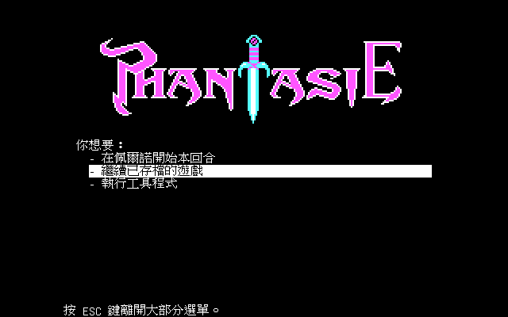
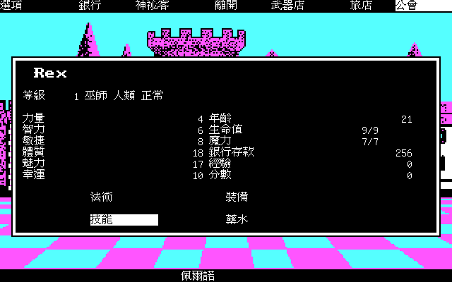
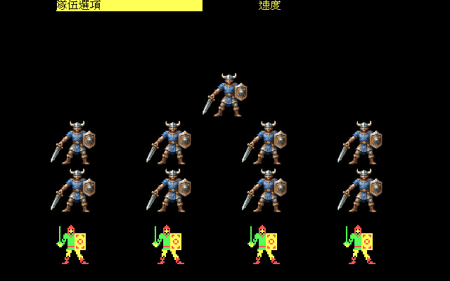

# 幽靈戰士（Phantasie）繁體中文化

以 [dosgolem](https://github.com/wicanr2/dosgolem) 執行期輸出攔截與覆繪，為 DOS 版 Phantasie 加上繁體中文、簡體中文、日文與韓文顯示，
並可切回英文原版。原版程式與資料不修改。

狀態：資料契約與正常 UI 類別抽樣已驗收，規格 001 至 012 為 CONFORMED。樣本涵蓋城鎮、公會、商店、地圖、地牢正文與選項、卷軸、戰鬥與獎勵、存檔讀回及語言切換。物品與法術的手冊題可顯示本機答案，保留原版選項，由玩家選答。
抽樣範圍見 [分期目標](docs/goals/001-phases.md#抽樣驗收範圍)。15 個新增鍵未逐鍵量到，地城備份還原及部分畫面操作參數仍未驗證。中文停用項目不重現原版變暗外觀。完整限制見 [CONTEXT.md](CONTEXT.md)。
ja、ko 為機器輔助翻譯，未經母語者校對。尚未建立正式交付包；這個 repo 目前是 private。

不含原版遊戲：原版與任何掃描檔都是使用者本機輸入，不進版控。專案規則見 [AGENTS.md](AGENTS.md)。

## 使用

需要 Docker、原版遊戲目錄（含 `PHANTASI.EXE`、`WIZ.BAT` 與資料檔）與 GNU Unifont 17.0.05 的壓縮檔。全部建置與驗證都在 Docker 內進行。

1. 建字型：`tools/build_fonts.sh <unifont-17.0.05.tar.gz> workplace/fonts`
2. 建互動前端：`tools/build_play.sh`（輸出 `workplace/bin/phantasie-play`）
3. 啟動：`workplace/bin/phantasie-play -root <原版目錄> -text text -font workplace/fonts -zoom 2`；`F11` 全螢幕、`F12` 切換語言；存檔放在 `$XDG_DATA_HOME/phantasie-cht`，不寫原版目錄
4. 實機冒煙：`tools/smoke_play.sh` 在虛擬顯示器內對五種語言各截一張標題畫面（`workplace/play-shots/`）

手冊提示需要本機的 `text/manual.<語言>.tsv`。此工作區已備妥四語答案表並重建字型。
重建時先在 Docker 內執行 `python -B tools/build_manual_catalog.py --reference workplace/manual-derived/answers.tsv --text text`，再建字型。
來源與規格見 [手冊來源](docs/re/012-manual-prompts.md)及[手冊答案提示](docs/spec/006-manual-answer-hints.md)。手冊與答案表不進版控；缺少答案表時保留原文題目。

## 驗收

- 規格在 `docs/spec/`（001 至 012），證據在 `docs/re/`，分期目標在 `docs/goals/`。
- 路線與收據：`tools/run_receipt.sh tests/routes/<路線>.route [-lang ja]`；同狀態 A/B：`tools/ab_receipt.sh tests/routes/<路線>.route`。收據的 PNG 與 TSV 在 `workplace/receipts/`。
- 存檔後冷啟動讀回：[tools/save_roundtrip.py](tools/save_roundtrip.py) 在 Docker 內呼叫已建置的 `phantasie-receipt`，以 `--receipt`、`--root`、`--routes`、`--text`、`--font`、`--out` 指定容器內路徑。原版、路線、譯文與字型唯讀掛載，輸出目錄可寫且須空白。契約與輸入隔離見 [005 §10](docs/spec/005-play-frontend-and-receipts.md#10-存檔層收據擴充)。
- 譯文是 `text/ui.<語言>.tsv` 與 `text/prose.<語言>.tsv`；檢查用 `tools/lint_catalog.py`（Docker 內）。

## 畫面

覆繪後的展示截圖在 `docs/screenshots/`（收據工具輸出的 2 倍畫面）：標題、城鎮、公會選單與角色屬性、銀行、旅店分配、大地圖提示、地城位置列、戰鬥訊息、神祕客訊息，另有日文與韓文的角色屬性畫面。

授權：採 RRSAL-1.0（復古重製 source-available 授權條款，非商業免費），不涵蓋原版素材；條款全文見 [LICENSE](LICENSE)。
