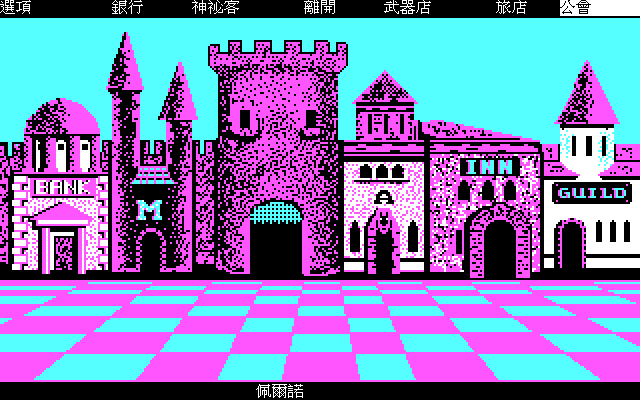
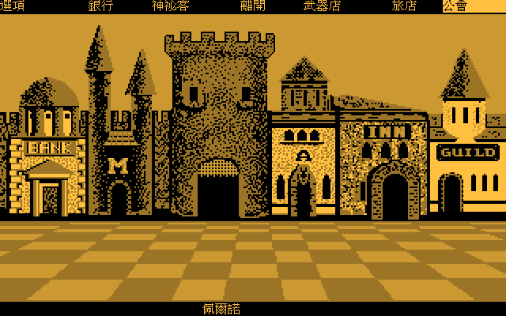
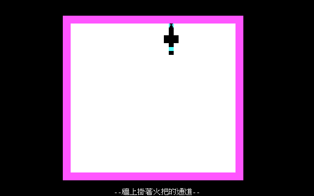

# 幽靈戰士（Phantasie）繁體中文化

以 [dosgolem](https://github.com/wicanr2/dosgolem) 執行期輸出攔截與覆繪，為 DOS 版 Phantasie 加上繁體中文、簡體中文、日文與韓文顯示，
並可切回英文原版。原版程式與資料不修改。

狀態：資料契約與正常 UI 類別抽樣已驗收，規格 001 至 012 為 CONFORMED。樣本涵蓋城鎮、公會、商店、地圖、地牢正文與選項、卷軸、戰鬥與獎勵、存檔讀回及語言切換。物品與法術的手冊題可顯示本機答案，保留原版選項，由玩家選答。
抽樣範圍見 [分期目標](docs/goals/001-phases.md#抽樣驗收範圍)。15 個新增鍵未逐鍵量到，地城備份還原及部分畫面操作參數仍未驗證。中文停用項目不重現原版變暗外觀。完整限制見 [CONTEXT.md](CONTEXT.md)。
ja、ko 為機器輔助翻譯，未經母語者校對。現行本機交付版為 `v.1.0.0-20261005`；這個 repo 目前是 private。

三平台本機完整版含遊戲、手冊提示與繁中倚天字形，補丁包採 GNU Unifont 的 OFL 1.1。前端可切換原版、琥珀與手繪主題；手繪組含四個場景及 160 個怪物圖像變體，正常城鎮與戰鬥已抽驗。全白、遮擋及無法確認的圖像保留原版。

交付位於 `dist-all/v.1.0.0-20261005/`：`full-local/` 為 Linux、Windows、macOS 完整版，`patch/` 為三平台補丁，`promo/` 為含實際遊玩、主題切換與第二版原創配樂的 72 秒影片，`smoke/` 與 `SHA256SUMS.json` 保存驗收及雜湊。完整版與影片只留本機，未建立公開 Release。Linux 已抽測五語與存檔讀回；Windows 已在 Wine 抽測五語標題與手繪城鎮；macOS 已核對雙架構及資產，尚未真機驗證。Windows 正常關閉亦未驗證。

儲存庫不含原版遊戲：原版與任何掃描檔都是使用者本機輸入，不進版控。專案規則見 [AGENTS.md](AGENTS.md)。

## 使用

需要 Docker、原版遊戲目錄（含 `PHANTASI.EXE`、`WIZ.BAT` 與資料檔）與 GNU Unifont 17.0.05 的壓縮檔。全部建置與驗證都在 Docker 內進行。

1. 建字型：`tools/build_fonts.sh <unifont-17.0.05.tar.gz> workplace/fonts`
2. 建互動前端：`tools/build_play.sh`（輸出 `workplace/bin/phantasie-play`）
3. 啟動：`workplace/bin/phantasie-play -root <原版目錄> -text text -font workplace/fonts -zoom 2`；`F11` 全螢幕、`F12` 切換語言、`Shift+F12` 切換主題；存檔放在 `$XDG_DATA_HOME/phantasie-cht`，不寫原版目錄
4. 實機冒煙：`tools/smoke_play.sh` 在虛擬顯示器內對五種語言各截一張標題畫面（`workplace/play-shots/`）

手冊提示需要本機的 `text/manual.<語言>.tsv`。此工作區已備妥四語答案表並重建字型。
重建時先在 Docker 內執行 `python -B tools/build_manual_catalog.py --reference workplace/manual-derived/answers.tsv --text text`，再建字型。
來源與規格見 [手冊來源](docs/re/012-manual-prompts.md)及[手冊答案提示](docs/spec/006-manual-answer-hints.md)。手冊與答案表不進版控；缺少答案表時保留原文題目。

## 驗收

- 規格及各自的抽樣範圍見 [規格索引](docs/spec/README.md)，證據在 `docs/re/`，分期目標在 `docs/goals/`。
- 路線與收據：`tools/run_receipt.sh tests/routes/<路線>.route [-lang ja]`；同狀態 A/B：`tools/ab_receipt.sh tests/routes/<路線>.route`。收據的 PNG 與 TSV 在 `workplace/receipts/`。
- 存檔後冷啟動讀回：[tools/save_roundtrip.py](tools/save_roundtrip.py) 在 Docker 內呼叫已建置的 `phantasie-receipt`，以 `--receipt`、`--root`、`--routes`、`--text`、`--font`、`--out` 指定容器內路徑。原版、路線、譯文與字型唯讀掛載，輸出目錄可寫且須空白。契約與輸入隔離見 [005 §10](docs/spec/005-play-frontend-and-receipts.md#10-存檔層收據擴充)。
- 譯文是 `text/ui.<語言>.tsv` 與 `text/prose.<語言>.tsv`；檢查用 `tools/lint_catalog.py`（Docker 內）。
- 封包的譯文中間輸入由 [tools/package_text.py](tools/package_text.py) 整理，於 Docker 內指定 `--source`、`--out` 及已定案的 `--version`。預設不讀本機答案，只保留兩個手冊標題；`--local-manual` 明示本機專用變體。這項工具不產生正式封包，契約見 [013](docs/spec/013-cross-platform-packaging.md)。
- 封包用的 [原生啟動器](apps/phantasie/launcher/main.go) 負責版本、原版匯入與存檔隔離，使用方式及 `bundle.json` 格式見 [013 §12](docs/spec/013-cross-platform-packaging.md#12-原生啟動器與研究抽測)。正式包已做 Linux／Wine 抽測；macOS 真機驗證仍未完成。
- 封包的 [外洩掃描工具](tools/package_scan.py) 在 Docker 內以 `--scan` 及 `--original` 核對實際內容；掃描來源缺席會失敗。它可檢查目錄、ZIP 與 tar，不能代替授權及可啟動性驗收，契約見 [013 §13](docs/spec/013-cross-platform-packaging.md#13-封包外洩掃描工具)。
- 封包的 [資產清冊與 ZIP 工具](tools/package_files.py) 核對必要譯文、字型覆蓋、包內路徑及 ZIP 實際內容，Docker 內的命令參數見 [013 §14](docs/spec/013-cross-platform-packaging.md#14-必要資產清冊與-zip-工具)。正式封裝仍須權利及平台驗證。
- [授權材料工具](tools/package_rights.py) 核對固定條款及來源，[平台組裝工具](tools/package_stage.py) 整理三平台布局並重建字型。都在 Docker 內執行，必要參數見 [013 §15、§16](docs/spec/013-cross-platform-packaging.md#15-授權材料整理)。組裝必須明示 OFL 1.1；正式三平台倚天封包的布局與資產已核對。
- 本機倚天字型用 [build_eten_font.py](tools/build_eten_font.py) 在 Docker 內指定 `--eten-dir`、`--base-font`、`--out`，以 GNU 繁中字型為基準替換全形字。來源與固定指紋見 [字型說明](font/README.md)，契約見 [014](docs/spec/014-local-eten-font.md)。正式完整版用 `package.sh --local --eten-dir <來源目錄>`；倚天字模不加入 Git 或可散布包。
- 手繪主題用後端 `-art <圖像目錄>` 載入，`-theme` 選 auto、original、amber、hd；沒有有效圖像時可切原版與琥珀。本機封包加 `--hd-dir <圖像目錄>`，完整圖像組的固定身份及抽樣限制見 [018](docs/spec/018-all-recognizable-hd-images.md)。
- [封包編排入口](tools/package.sh) 從乾淨 Git 提交建置；`--build-only` 只產生研究編譯，不讀字型或原版、不建立 tag。正式包須明示字型條款及已有精確 tag，仍須平台冒煙。固定工具鏈、輸入及 Docker 內步驟見 [013 §17](docs/spec/013-cross-platform-packaging.md#17-封包編排與乾淨建置)。

## 畫面

覆繪後的展示截圖在 `docs/screenshots/`：標題、城鎮與琥珀主題、公會選單與角色屬性、銀行、旅店分配、大地圖提示、地城位置列、戰鬥訊息，另有日文與韓文的角色屬性畫面。

以下為正式本機完整版實際遊玩的繁中倚天字形畫面。城鎮與怪物採手繪主題，另展示琥珀主題；隊員圖保留原版。其餘畫廊畫面仍為 GNU 字型。

授權：採 RRSAL-1.0（復古重製 source-available 授權條款，非商業免費），不涵蓋原版素材；條款全文見 [LICENSE](LICENSE)。
